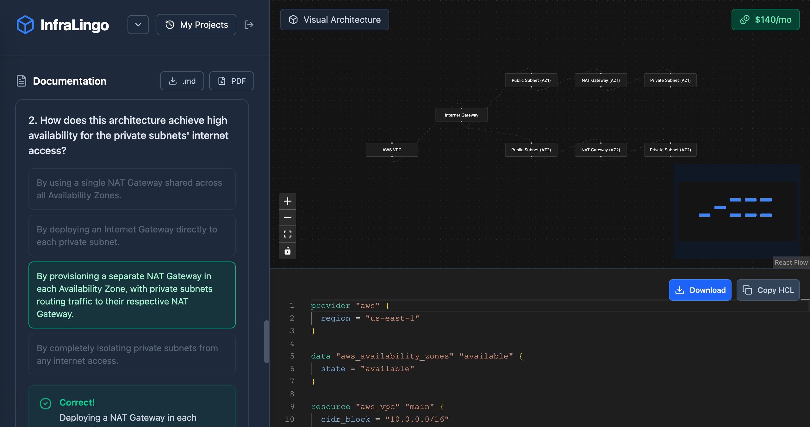
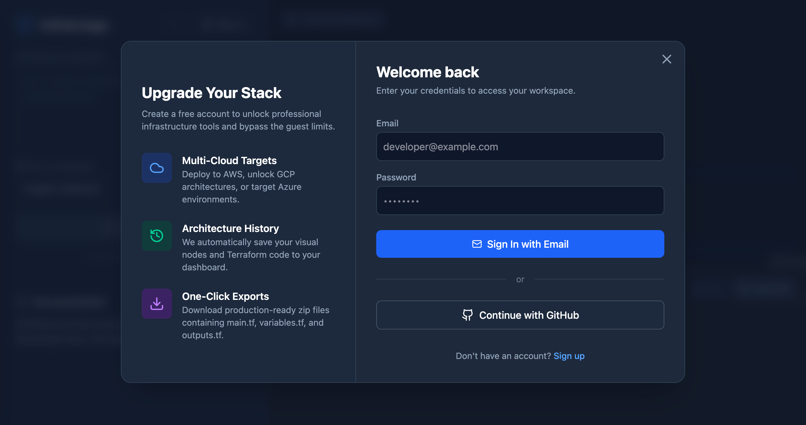

# 🏗️ InfraLingo

**An Intent-Based Cloud Architect and Multilingual Study Companion.**


Building cloud infrastructure is hard; mastering it in a second language is even harder.

**InfraLingo** is an AI-powered cloud architect built for global engineering teams and students. You simply describe the infrastructure you need in plain English, and InfraLingo instantly generates the production ready Terraform code, a visual topology map, and dynamic cost estimates.

But it doesn't stop at building it **teaches**. Powered by Gemini and Lingo.dev, InfraLingo features a dedicated **Study Mode** that generates detailed architectural breakdowns and interactive, multilingual knowledge checks, allowing engineers to seamlessly bridge the gap between deploying code and deeply understanding cloud concepts in their native language.

---

## 💡 The Inspiration

Staring at walls of Terraform documentation isn't how humans learn best. When preparing for rigorous certifications like the Associate Cloud Engineer exam, the gap between "copy and pasting code" and "understanding the architecture" becomes painfully obvious. Furthermore, the vast majority of premium cloud learning resources assume the user speaks fluent English.

InfraLingo was built to democratize cloud engineering. By shifting from manual "drag-and-drop" canvases to an **Intent-Based** model, you just type what you want to achieve. The AI handles the heavy lifting, visualizes it, and tutors you on exactly _why_ those specific cloud primitives were chosen, translated perfectly into your preferred language.

---

## ✨ Key Features

- **🧠 Intent-to-Infrastructure:** Type a prompt like _"Create a highly available AWS VPC with an RDS database"_ and get valid Terraform code instantly.
- **🗺️ Interactive Topology Canvas:** Powered by React Flow, visualize exactly how your VPCs, Subnets, and Gateways connect.
- **🎓 Multilingual Study Mode:** Generates deep-dive explanations of the architecture, localized into Spanish, French, German, Japanese, and more using the Lingo.dev API.
- **📝 Dynamic Knowledge Checks:** Automatically generates interactive, multiple-choice quizzes based on the specific architecture on the canvas to test your understanding.
- **💰 Live Cost Estimation:** Get instant monthly cost breakdowns (e.g., EC2 instances, Load Balancers) directly on the visual canvas.
- **📂 Freemium Auth & History:** Secure user authentication with a project history dashboard to save, revisit, and iterate on past architectures.

---

## 🧠 Study Mode

Most infrastructure generators stop at the code. InfraLingo transforms into a personalized cloud tutor. When you toggle **Study Mode**, the AI analyzes the architecture it just built and generates a comprehensive learning experience:

- **Architectural Breakdowns:** It doesn't just give you code; it explains the why. (e.g., Why was a NAT Gateway chosen instead of an Internet Gateway? Why is the URL Map required here?)
- **Native-Language Learning:** Powered by the Lingo.dev API, these complex architectural audits are perfectly localized into Spanish, French, German, Portuguese, or Japanese without breaking Markdown formatting.
- **Interactive Knowledge Checks:** The app dynamically generates a custom multiple-choice quiz to test your understanding of the specific topology on your canvas.
- **Infinite Exam Prep:** Studying for the Cloud Engineer exam? Click "Generate 5 More Questions" to have Gemini instantly read your current Terraform file and generate brand-new, unique questions, turning InfraLingo into an endless cloud flashcard engine.



---

## 📸 Interface Showcase

### 1. Project History & Workspace

Easily jump back into past architectural designs. Your visual nodes and Terraform code are saved securely to your dashboard.
 ### 2. Seamless Upgrades
A clean, frictionless authentication layer designed to transition guest users into authenticated power users.
 ---

## 🛠️ Technical Stack

**Frontend:**

- React 18 + TypeScript + Vite
- Tailwind CSS (Styling & Animations)
- Zustand (Global State Management)
- React Flow (Node-based Interactive Canvas)
- Lucide React (Iconography)

**Backend:**

- Node.js + Express
- PostgreSQL (Database)
- JSON Web Tokens (JWT Auth)

**AI & APIs:**

- **Google Gemini 2.5 Flash:** Powers the intent parsing, Terraform generation, JSON structuring, and dynamic quiz generation.
- **Lingo.dev API:** Handles the semantic localization of complex architectural documentation into multiple target languages without breaking markdown formatting.

---

## 🚀 Getting Started (Local Development)

### Prerequisites

- Node.js (v18+)
- PostgreSQL running locally or via a cloud provider
- API Keys for Gemini and Lingo.dev

### Setup Instructions

1. **Clone the repository**
   ```bash
   git clone [https://github.com/dea1j/InfraLingo.git](https://github.com/dea1j/InfraLingo.git)
   cd InfraLingo
   ```
2. **Backend Setup**

   ```bash
   cd backend
   npm install

   # Create a .env file based on .env.example
   # Add your DATABASE_URL, JWT_SECRET, GEMINI_API_KEY, and LINGO_API_KEY

   npm run dev
   ```

3. **Frontend Setup**

   ```bash
   cd ../frontend
   npm install
   npm run dev
   ```

4. **Visit the App**
   ```bash
   Open http://localhost:5173 in your browser!
   ```

## 🔮 What's Next?

- **Multi-File Export:** Download complete **.zip** files containing **main.tf**, **variables.tf**, and **outputs.tf**.
- **Reverse Engineering:** Upload an existing **main.tf** file and have InfraLingo draw the canvas and generate a quiz on your own code.
- **Cloud Integrations:** Direct deployment hooks to AWS, GCP, and Azure.
